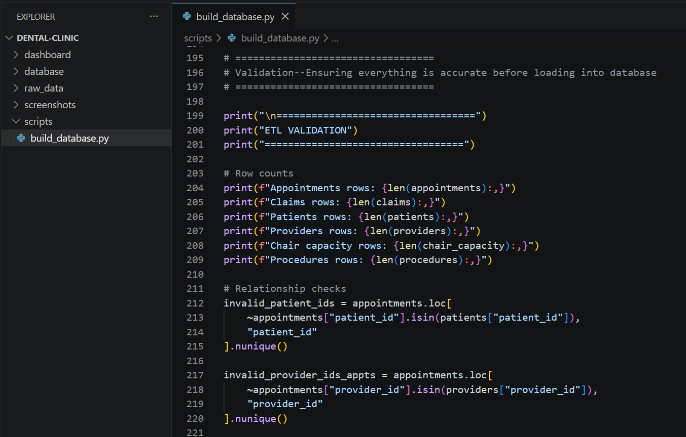
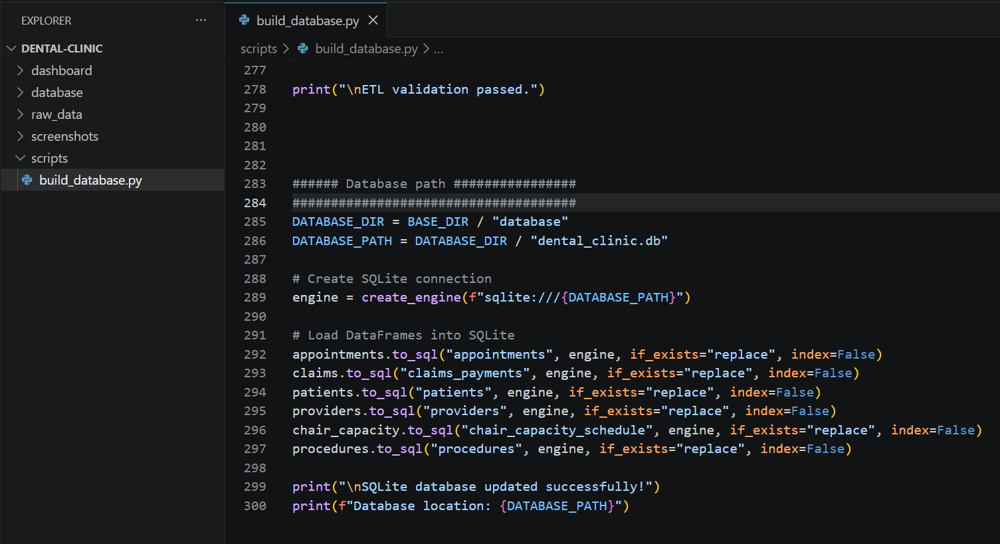
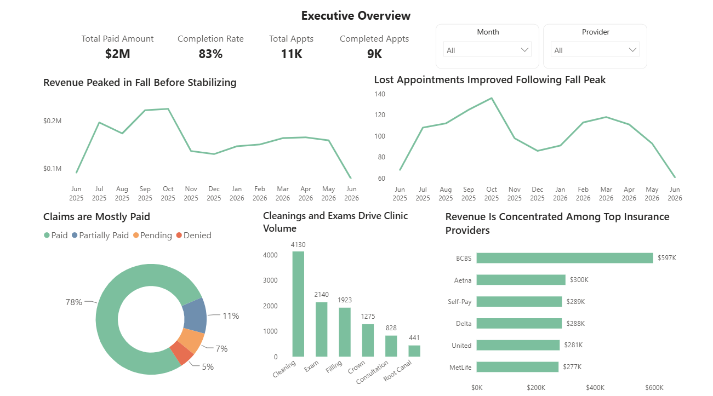
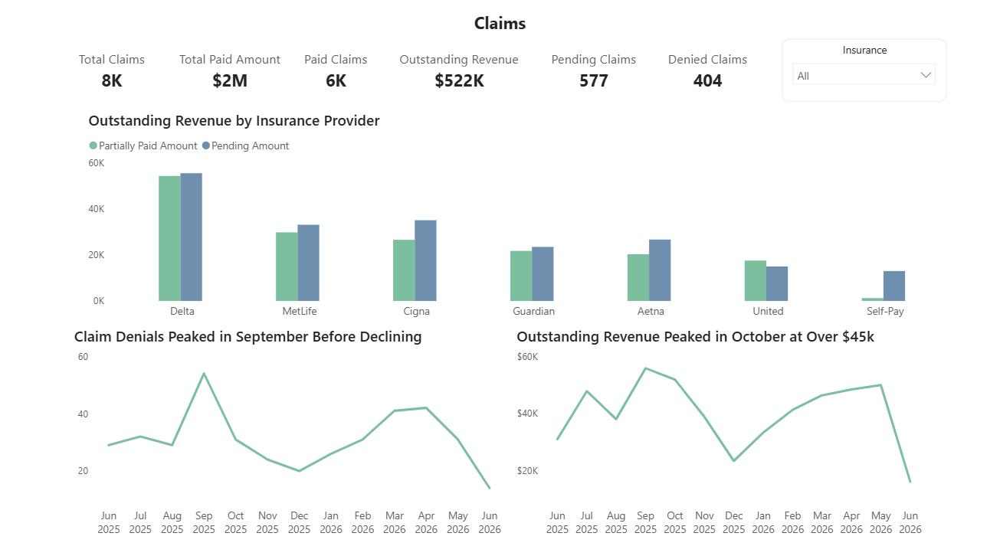
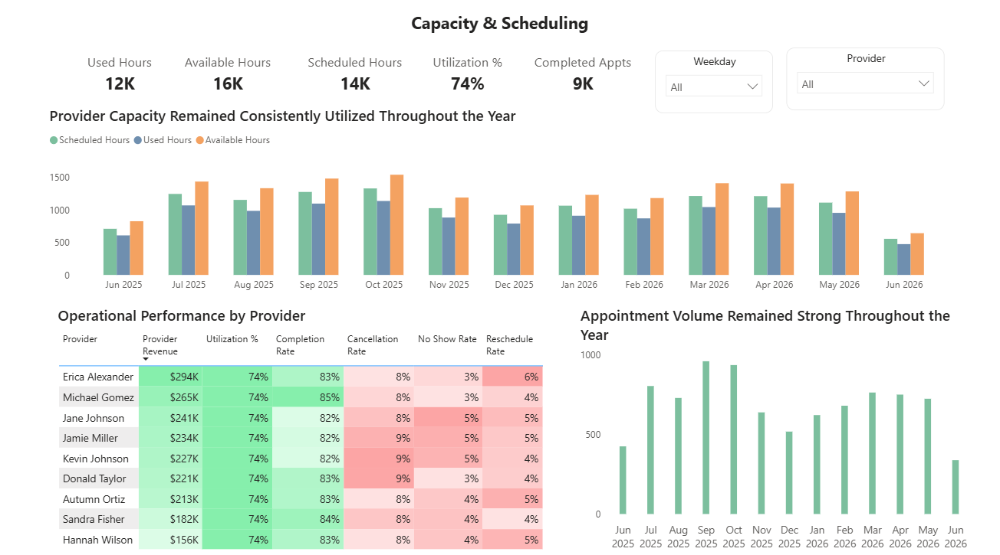
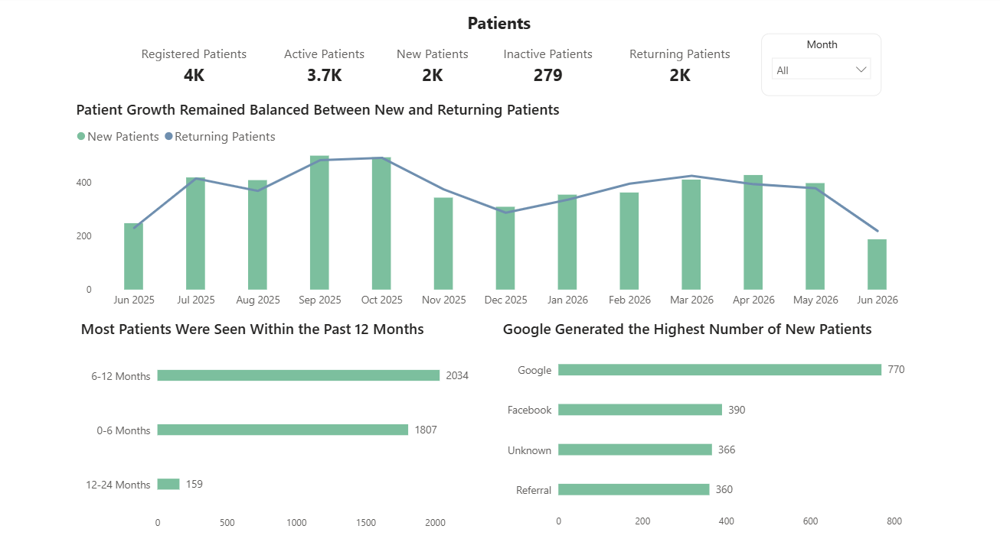

# Dental Clinic Operations Analytics Pipeline

An end-to-end healthcare analytics solution that transforms raw operational data into executive-ready business intelligence.

Using **Python, SQLite, SQL, and Power BI**, this project demonstrates how an automated analytics pipeline can clean, validate, store, and visualize clinic data to support operational and financial decision-making.

---

# Business Problem

Dental clinics generate large amounts of operational data from scheduling, patient management, provider activity, chair utilization, and insurance claims. Without centralized reporting, identifying trends, operational bottlenecks, and financial performance can be difficult.

This project demonstrates how a modern analytics workflow can transform raw clinic data into meaningful insights for practice leadership.

---

# Business Impact

This dashboard enables clinic leadership to:

- Monitor operational performance through executive KPIs
- Track provider productivity and chair utilization
- Analyze patient acquisition and referral sources
- Monitor insurance claims and outstanding revenue
- Identify scheduling and capacity trends
- Support faster, data-driven business decisions

---

# Toolkit

- Python
- Pandas
- SQLite
- SQL
- Power BI
- DAX

---

# Analytics Pipeline

This project follows an end-to-end analytics workflow:

1. Generate synthetic dental clinic data
2. Clean and standardize datasets using Python
3. Validate relationships and business rules
4. Load cleaned data into SQLite
5. Connect Power BI directly to the database through ODBC
6. Build executive dashboards and business KPIs

 

### SQLite Database Loading

After validation passes, the pipeline loads each cleaned dataset into a centralized SQLite database. Power BI connects directly to this database, creating a repeatable reporting workflow that separates raw operational data from analytics-ready data.




---

# Dashboard

## Executive Overview

Provides an executive snapshot of clinic performance, including revenue, appointments, patient demand, and operational trends.



---

## Insurance & Claims

Tracks insurance performance, claim status distribution, collections, and outstanding revenue to support revenue cycle management.



---

## Schedule & Capacity

Monitors provider scheduling, chair utilization, operational capacity, and resource planning.



---

## Patient Analytics

Analyzes patient growth, referral sources, demographics, and patient retention trends.



---

# Key Metrics

- Total Revenue
- Outstanding Revenue
- Appointment Completion Rate
- Provider Productivity
- Chair Utilization
- Insurance Claims
- Collection Rate
- Patient Growth
- Referral Sources
- Patient Retention

---

# Repository Structure

```text
Dental-Clinic-Operations/
│
├── data/
├── database/
├── python/
├── sql/
├── screenshots/
│   └── dashboard/
│       ├── exec-overview.png
│       ├── claims.png
│       ├── schedule.png
│       └── patients.png
│
├── README.md
└── dental_clinic.pbix
```

---

# Skills Demonstrated

- End-to-End Analytics Pipeline Development
- Data Cleaning & Validation
- Relational Database Design
- SQL Querying
- Data Modeling
- Dashboard Development
- Executive KPI Reporting
- Healthcare Analytics
- Business Intelligence
- DAX Measure Development
- Business Storytelling

---

# Future Enhancements

- Automated pipeline scheduling
- Predictive patient demand forecasting
- Provider performance benchmarking
- Multi-clinic reporting
- Power BI Service deployment
